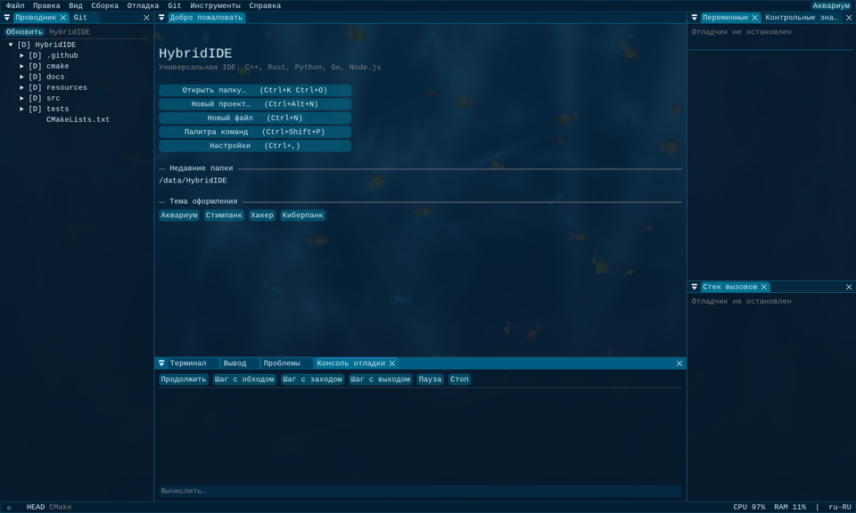
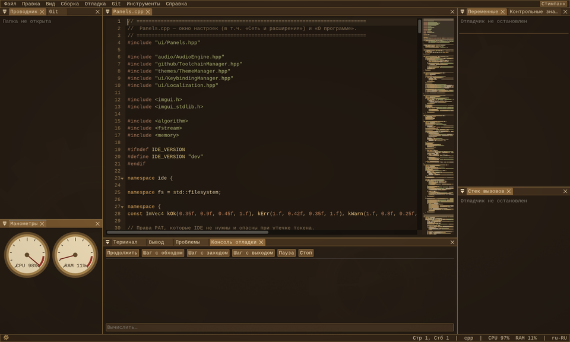
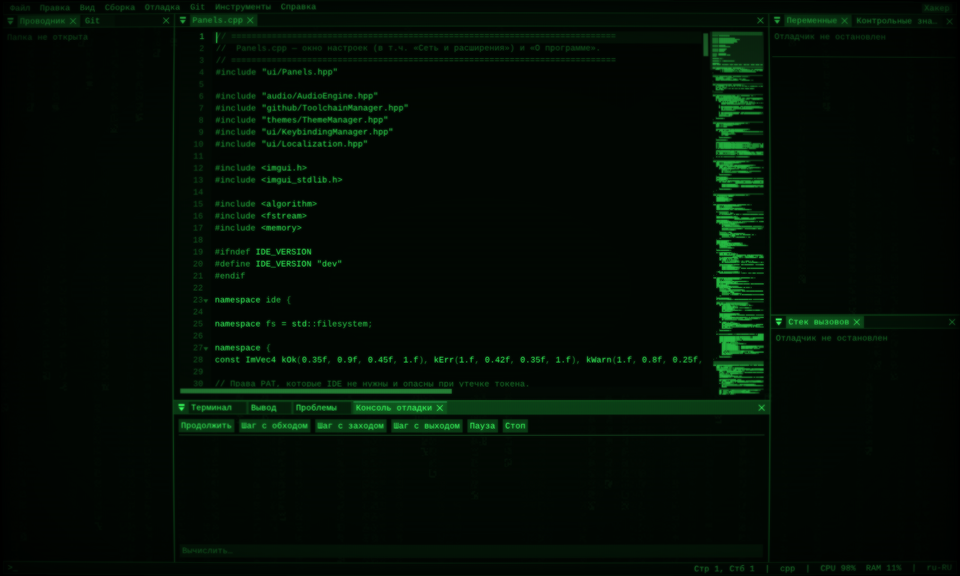
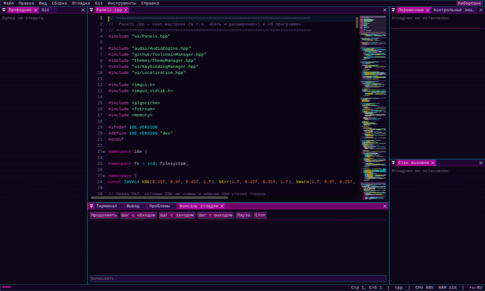

# HybridIDE

Кроссплатформенная IDE на **C++20** (опционально C++23) с интерфейсом на
**Dear ImGui (docking + multi-viewport)**, GLFW и OpenGL 3.3. Поддерживает C++,
Rust, Python, Go и Node.js через протоколы **LSP** и **DAP**, имеет встроенный
PTY-терминал, Git-клиент, телеметрию системы и четыре «живые» темы с шейдерами
и процедурным звуком.



| Стимпанк | Хакер | Киберпанк |
|---|---|---|
|  |  |  |

## Возможности

| Область | Что реализовано |
|---|---|
| **Редактор** | мультикурсор, Ctrl+D (следующее вхождение), свёртка блоков, миникарта, подсветка 9 языков, парные скобки, поиск, ghost-text автодополнение (Tab — принять, Alt+[ / ] — листать), hover, переход к определению, точки останова в gutter |
| **LSP** | clangd, rust-analyzer, pyright/pylsp, gopls, typescript-language-server — запускаются по требованию; диагностика (волнистые линии), completion, hover, definition; команды переопределяются в `.ide_workspace.json` |
| **DAP** | lldb-dap / `gdb -i dap` / debugpy / dlv; панели «Стек вызовов», «Переменные» (дерево), «Контрольные значения», «Точки останова», «Память» (hex-дамп), «Консоль отладки»; автоконфигурация по типу проекта + свой `debugConfig` |
| **Терминал** | настоящий PTY: `posix_openpt` (Linux/macOS), **ConPTY** (Windows 10+); VT100/ANSI-цвета, scrollback, несколько вкладок |
| **Сборка** | автоопределение CMake / Cargo / Go / Python / npm / Make, Build / Run / Test / Clean, прогресс `[n/m]`, разбор ошибок GCC/Clang/MSVC/rustc/Go/TS/Python в панель «Проблемы» с переходом к строке |
| **Git** | статус, stage/unstage, commit/amend, ветки, pull/push, история с графом, side-by-side diff |
| **Проводник** | дерево проекта, фоновый watcher изменений, контекстное меню (создать/переименовать/удалить/копировать путь/собрать/запустить), окно «Свойства» |
| **Мастер проектов** | шаблоны C++ (CMake), Rust (Cargo), Python, Go, Node.js с опциями и `git init`; пользовательские шаблоны JSON |
| **Телеметрия** | ImPlot-графики CPU / RAM / GPU (NVML для NVIDIA, sysfs для AMD/Intel) и памяти самой IDE; сбор в отдельном потоке |
| **Клавиатура** | пресеты **VS Code** и **Visual Studio**, двухшаговые сочетания (`Ctrl+K Ctrl+C`), редактор переназначения с поиском и детектором конфликтов, палитра команд (Ctrl+Shift+P) |
| **Локализация** | ru-RU / en-US с горячей сменой без перезапуска; JSON-переопределения и новые языки в `resources/locales` |
| **GitHub** | PAT в защищённом хранилище ОС, проверка прав (предупреждение об избыточных scope), поиск и установка расширений (topic `hybridide-extension`), установка тулчейнов из release-ассетов, бэкап/восстановление настроек в приватный репозиторий через `POST /user/repos` |
| **Темы** | Аквариум, Стимпанк, Хакер, Киберпанк — у каждой своя подпанель настроек (громкость эффектов/фона, вкл/выкл звука, фоновое изображение до 4K, визуальные параметры) |

### Темы подробнее

* **Аквариум** — каустика и лучи (GLSL), рябь на воде по клику (волновое
  уравнение на CPU, текстура R32F), косяк рыб на алгоритме **boids** со
  spatial hash; рыбы пугаются кликов. Звуки: всплеск с панорамой по позиции
  клика, пузырьки при наборе, океан на фоне.
* **Стимпанк** — латунные шестерни, скорость которых зависит от загрузки CPU,
  манометры CPU/RAM со стрелками с инерцией, пар и сепия при сборке, звук
  печатной машинки и звонок каретки на Enter.
* **Хакер** — «матричный дождь», CRT-кривизна, строки развёртки, фосфорное
  свечение (зелёный/янтарный), щелчки реле, гул кинескопа.
* **Киберпанк** — неоновый город, хроматическая аберрация, **глитч-импульс
  при смене активной панели**, синтезаторные звуки.

Все звуки синтезируются процедурно (miniaudio, простой ревербератор
Шрёдера) — внешние аудиофайлы не нужны, но любой эффект можно заменить своим
WAV/MP3/FLAC.

## Сборка

Требуется CMake ≥ 3.20, компилятор с C++20 (MSVC 2022, GCC ≥ 11, Clang ≥ 15)
и интернет при первой конфигурации (зависимости скачиваются через
FetchContent: GLFW 3.4, Dear ImGui 1.91.9b-docking, ImPlot, nlohmann/json,
miniaudio, stb_image; libcurl берётся из системы или собирается).

```bash
# Linux (Debian/Ubuntu)
sudo apt install ninja-build libcurl4-openssl-dev libgl1-mesa-dev libx11-dev \
  libxrandr-dev libxinerama-dev libxcursor-dev libxi-dev libxkbcommon-dev libwayland-dev

cmake -S . -B build -G Ninja -DCMAKE_BUILD_TYPE=Release
cmake --build build
ctest --test-dir build          # юнит-тесты ядра
./build/HybridIDE [папка-проекта]
```

```powershell
# Windows (Developer PowerShell for VS 2022)
cmake -S . -B build -G "Visual Studio 17 2022"
cmake --build build --config Release
.\build\Release\HybridIDE.exe
```

Опции CMake: `IDE_USE_CXX23`, `IDE_BUILD_TESTS`, `IDE_BUILD_APP`,
`IDE_WARNINGS_AS_ERRORS`. Флаг запуска `--safe-mode` отключает шейдеры и звук.

### Языковые серверы и отладчики

IDE ищет их в `PATH` (или ставит через «Сеть и расширения → Тулчейны»):

| Язык | LSP | DAP |
|---|---|---|
| C/C++ | `clangd` | `lldb-dap` или `gdb -i dap` (GDB ≥ 14) |
| Rust | `rust-analyzer` | `lldb-dap` |
| Python | `pyright-langserver --stdio` / `pylsp` | `python -m debugpy.adapter` |
| Go | `gopls` | `dlv dap` |
| JS/TS | `typescript-language-server --stdio` | `js-debug-adapter` |

## Настройки и файлы

* `~/.config/HybridIDE/` (Windows: `%APPDATA%\HybridIDE\`) — `settings.json`,
  `keybindings.json`, `imgui_layout.ini`, расширения, тулчейны;
* `<проект>/.ide_workspace.json` — открытые файлы, точки останова, свёртки,
  аргументы запуска, `lspOverrides`, `debugConfig` (аналог `launch.json`);
* GitHub-токен хранится отдельно: DPAPI (Windows) или файл с правами `0600`;
  можно задать переменной `HYBRIDIDE_GITHUB_TOKEN`. В бэкап токен не попадает.

### Формат расширения

Репозиторий с topic `hybridide-extension` и файлом `hybridide-extension.json`:

```json
{
  "name": "Solarized Aquarium", "version": "1.0.0", "type": "theme",
  "description": "Тёплая палитра для темы Аквариум",
  "files": ["theme.json"], "theme": "theme.json"
}
```

Типы: `theme`, `keymap`, `toolchain`, `template`. Расширения декларативные —
IDE **не исполняет** код из них (пути проверяются на path traversal).

## Структура

```
src/
  app/        Application — композиционный корень, главный цикл, меню, докинг
  core/       редактор, буфер, подсветка, терминал (PTY), Git, сборка, проводник, процессы, async
  lsp/        JSON-RPC framing, LSP-клиент, DAP-клиент и панели отладки
  github/     HTTP (libcurl), GitHub REST, менеджер тулчейнов
  graphics/   загрузчик GL, шейдеры тем, волны, рыбы (boids)
  audio/      миксер miniaudio, синтез эффектов, реверберация
  themes/     ThemeManager — стили, палитры, механики и подпанели тем
  ui/         локализация, клавиши, телеметрия, настройки, диалог файлов
  platform/   SystemInfo — CPU/RAM/GPU
resources/    раскладки клавиш, словари, шейдеры-переопределения, шрифты
tests/        юнит-тесты ядра
docs/         архитектура, скриншоты
```

Подробнее — в [docs/ARCHITECTURE.md](docs/ARCHITECTURE.md).

## Лицензия

MIT — см. [LICENSE](LICENSE).
